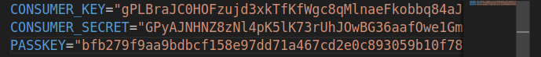

# MPESA STK PUSH

### 1. clone the project/repository
```
git clone https://github.com/Collins331/mpesa-stk-push.git
```

### 2. Create a virtual environment and activate
```
python -m venv env
```
#### To activate:
_Windows_
```
.\env\Scripts\activate
```
_Linux_
```
source env/bin/activate
```

### 3. Install the packages
```
pip install -r requirements.txt
```

### 4. Create .env file at the root of the repository and add the following details
```
CONSUMER_KEY="Your Consumer Key"
CONSUMER_SECRET="Your Consumer Secret"
PASSKEY="Your Pass key"
```

Note: Replace the values of these variables with correct details from the MPESA developer account

Example

### 5. Migrate the project
```
python3 manage.py migrate
```

### 6. Runserver
```
python3 manage.py runserver
```

Visit the url http://127.0.0.1:8000


Support by giving the project a star '✨'